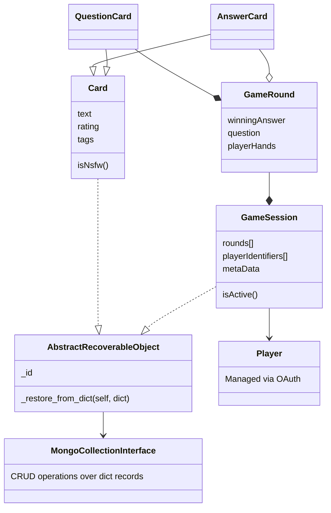

# MongoDB cluster
This repository contains the source code for an interface container, providing an http api for the database.

## Classes diagram

```mermaid
classDiagram
    AbstractRecoverableObject --> MongoCollectionInterface
    MongoCollectionInterface : CRUD operations over dict records
    AbstractRecoverableObject : _id
    AbstractRecoverableObject : _restore_from_dict(self, dict)
    Card ..|> AbstractRecoverableObject
    GameSession ..|> AbstractRecoverableObject
    QuestionCard --* GameRound
    AnswerCard --o GameRound
    AnswerCard --|> Card
    QuestionCard --|> Card
    Card : text
    Card : isNsfw()
    Card : rating
    Card : tags
    GameSession --> Player
    GameSession : isActive()
    GameSession : rounds[]
    GameSession : playerIdentifiers[]
    GameSession : metaData
    GameRound --* GameSession
    GameRound : winningAnswer
    GameRound : question
    GameRound : playerHands
    Player : Managed via OAuth
```
